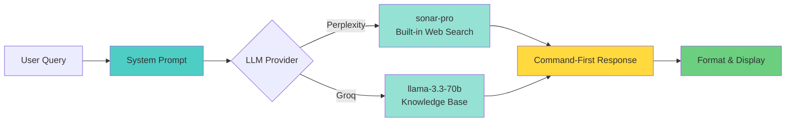

# Cyx

Fast, terminal-based cybersecurity companion for penetration testing and security research.

## What is Cyx?

Cyx is an LLM-powered command companion that provides instant, concise cybersecurity commands and techniques. Built specifically for penetration testers and security students, it delivers command-first responses optimized for practical use in the field.

## Quick Start

```bash
# Build
cargo build --release

# Setup (first time)
cargo run -- setup

# Use
cyx "nmap stealth scan"
cyx "sql injection bypass waf"
cyx "linux privilege escalation"
```

## How It Works



## Features

- **Fast responses** - 2-5 seconds average with optimized LLM queries
- **Learn mode** - Detailed educational breakdowns with flag explanations and sources
- **Source tracking** - Every response shows provider, model, and search capability
- **Secure** - API keys stored with 600 permissions in local config
- **Command-first** - Executable commands before explanations
- **Pentester-optimized** - System prompts tuned for security professionals
- **Dual LLM support** - Perplexity (built-in web search) or Groq (fast inference)
- **Interactive mode** - Conversation history for follow-up questions
- **CLI flags** - Quiet, verbose, no-tty, learn modes for different workflows

## Installation

### Prerequisites

- Rust 1.70+
- API key for [Perplexity](https://www.perplexity.ai/settings/api) or [Groq](https://console.groq.com)

### Build from Source

```bash
git clone https://github.com/neur0map/cyx.git
cd cyx
cargo build --release
cargo install --path .
```

## Usage

### One-Shot Queries
```bash
cyx "reverse shell one liner"
cyx "hydra ssh brute force"
cyx "metasploit meterpreter"
```

### Interactive Mode
```bash
cyx
# Ask questions, get follow-ups
cyx> how to crack wifi
cyx> /exit
```

### CLI Flags
```bash
cyx -q "command"         # Quiet mode (no headers/sources)
cyx -v "command"         # Verbose mode (detailed progress)
cyx --no-tty "command"   # No-TTY for scripting
cyx -l "command"         # Learn mode (detailed explanations)
cyx --learn "command"    # Learn mode (long form)
```

## Configuration

```bash
cyx config show              # View config
cyx config set provider groq # Change provider
cyx setup                    # Re-run setup wizard
```

Config location: `~/.config/cyx/config.toml`

## Example Output

### Normal Mode
```bash
$ cyx "nmap stealth scan"

[*] COMMAND RESULT
───────────────────────────────────────
```bash
nmap -sS <target>
```
TCP SYN stealth scan - doesn't complete handshake. Requires root.

[*] SOURCES
───────────────────────────────────────
Provider: Perplexity (sonar-pro)
Search: Yes (performed web search)
```

### Learn Mode
```bash
$ cyx --learn "nmap stealth scan"

[*] COMMAND RESULT
───────────────────────────────────────
```bash
nmap -sS <target>
```
TCP SYN scan - doesn't complete handshake, harder to detect. Requires root.

Tool: nmap (Network Mapper)
  Industry-standard network scanner for reconnaissance and security auditing
  Created by Gordon Lyon (Fyodor), GPL license

Flags:
  -sS    TCP SYN Scan (Stealth Scan)
         - Sends TCP SYN packet to each target port
         - Waits for SYN-ACK (open) or RST (closed) response
         - Sends RST to close connection before handshake completes
         - Requires root/sudo for raw socket access
         - Faster than full TCP connect scan

How it works:
  1. Sends TCP SYN packet to target port
  2. If open: receives SYN-ACK, marks as open, sends RST
  3. If closed: receives RST, marks as closed
  4. If filtered: no response or ICMP unreachable

Advantages:
  - Fast, doesn't complete full TCP handshake
  - Stealthy, may not appear in application logs
  - Reliable port state detection

Disadvantages:
  - Requires root privileges
  - Can be detected by modern IDS/IPS
  - Some firewalls may block SYN packets

When to use:
  - Default choice for most port scans
  - Initial network reconnaissance
  - When you have root access

Alternatives:
  -sT    TCP connect (no root needed, slower)
  -sN    TCP NULL scan (bypass some firewalls)
  -sF    TCP FIN scan (bypass some firewalls)

Example usage:
  nmap -sS 192.168.1.100
  nmap -sS -p 22,80,443 example.com
  nmap -sS 10.0.0.0/24

Sources: nmap official documentation, RFC 793 (TCP)

[*] SOURCES
───────────────────────────────────────
Provider: Perplexity (sonar-pro)
Search: Yes (performed web search)
```

## Security

Cyx implements multiple security measures:
- **Secure key storage** - API keys stored with 600 file permissions
- **No execution** - Read-only, provides commands but doesn't execute them
- **Timeout limits** - API calls timeout after 120 seconds
- **Local config only** - All sensitive data stays on your machine

## System Prompt

Cyx uses a carefully crafted system prompt that:
- Assumes user authorization for all pentesting activities
- Prioritizes command-first responses (no fluff)
- Targets professional pentesters and security students
- Provides practical, executable commands
- Includes ethical context (authorized testing, CTFs, education)

## Documentation

- [Full Documentation](docs/FULL_README.md)
- [Features](docs/FEATURES.md)
- [Testing Report](docs/TESTING.md)

## License

MIT License - See [LICENSE](LICENSE)

## Disclaimer

For authorized security testing, education, and defensive purposes only. Always obtain proper authorization before testing systems you don't own.
