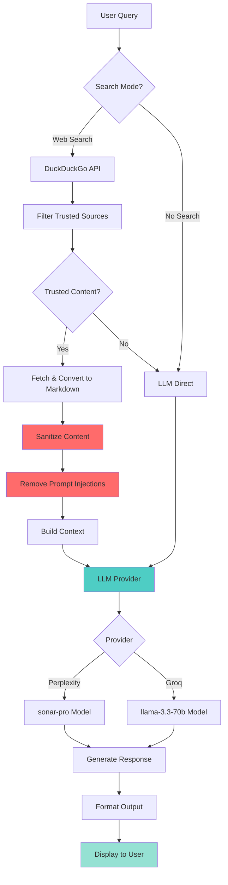

# Cyx

Fast, terminal-based cybersecurity companion for penetration testing and security research.

## What is Cyx?

Cyx retrieves commands, documentation, and techniques from trusted sources like HackTricks, PayloadsAllTheThings, and OWASP. It uses LLMs to provide concise, actionable answers directly in your terminal.

## Quick Start

```bash
# Build
cargo build --release

# Setup (first time)
cargo run -- setup

# Use
cyx "nmap stealth scan"
cyx "sql injection bypass waf"
cyx "linux privilege escalation"
```

## How It Works



## Features

- **Fast responses** - 2-5 seconds average
- **Secure** - API keys stored with 600 permissions
- **Concise output** - Commands first, brief explanations
- **Trusted sources** - HackTricks, PayloadsAllTheThings, OWASP, GTFOBins
- **Interactive mode** - Follow-up questions with context
- **CLI flags** - Quiet, verbose, no-tty modes for scripting

## Installation

### Prerequisites

- Rust 1.70+
- API key for [Perplexity](https://www.perplexity.ai/settings/api) or [Groq](https://console.groq.com)

### Build from Source

```bash
git clone https://github.com/neur0map/cyx.git
cd cyx
cargo build --release
cargo install --path .
```

## Usage

### One-Shot Queries
```bash
cyx "reverse shell one liner"
cyx "hydra ssh brute force"
cyx "metasploit meterpreter"
```

### Interactive Mode
```bash
cyx
# Ask questions, get follow-ups
cyx> how to crack wifi
cyx> /exit
```

### CLI Flags
```bash
cyx -q "command"          # Quiet mode
cyx -v "command"          # Verbose mode
cyx --no-tty "command"    # No-TTY for scripting
cyx --no-search "command" # Skip web search
```

## Configuration

```bash
cyx config show              # View config
cyx config set provider groq # Change provider
cyx setup                    # Re-run setup wizard
```

Config location: `~/.config/cyx/config.toml`

## Example Output

```bash
$ cyx "nmap stealth scan"

--- Response ---
```bash
nmap -sS <target>
```
-sS performs a TCP SYN stealth scan. Requires root privileges.
```

## Security

Cyx implements multiple security measures:
- **Prompt injection protection** - Sanitizes web content
- **Secure key storage** - 600 file permissions
- **Resource limits** - Timeouts, content size limits
- **Safe defaults** - No execution, read-only operations

See [docs/TESTING.md](docs/TESTING.md) for security validation details.

## Documentation

- [Full Documentation](docs/FULL_README.md)
- [Features](docs/FEATURES.md)
- [Testing Report](docs/TESTING.md)

## Trusted Sources

- HackTricks
- PayloadsAllTheThings
- OWASP
- GTFOBins
- LOLBAS
- Exploit Database
- PentestMonkey
- HackingArticles
- Red Team Notes

## License

MIT License - See [LICENSE](LICENSE)

## Disclaimer

For authorized security testing, education, and defensive purposes only. Always obtain proper authorization before testing systems you don't own.
