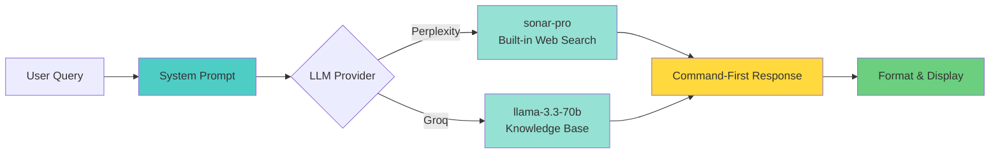

# Cyx

Fast, terminal-based cybersecurity companion for penetration testing and security research.

## What is Cyx?

Cyx is an LLM-powered command companion that provides instant, concise cybersecurity commands and techniques. Built specifically for penetration testers and security students, it delivers command-first responses optimized for practical use in the field.

## Quick Start

```bash
# Build
cargo build --release

# Setup (first time)
cargo run -- setup

# Use
cyx "nmap stealth scan"
cyx "sql injection bypass waf"
cyx "linux privilege escalation"
```

## How It Works



## Features

- **Fast responses** - 2-5 seconds average with optimized LLM queries
- **Secure** - API keys stored with 600 permissions in local config
- **Command-first** - Executable commands before explanations
- **Pentester-optimized** - System prompts tuned for security professionals
- **Dual LLM support** - Perplexity (built-in web search) or Groq (fast inference)
- **Interactive mode** - Conversation history for follow-up questions
- **CLI flags** - Quiet, verbose, no-tty modes for scripting

## Installation

### Prerequisites

- Rust 1.70+
- API key for [Perplexity](https://www.perplexity.ai/settings/api) or [Groq](https://console.groq.com)

### Build from Source

```bash
git clone https://github.com/neur0map/cyx.git
cd cyx
cargo build --release
cargo install --path .
```

## Usage

### One-Shot Queries
```bash
cyx "reverse shell one liner"
cyx "hydra ssh brute force"
cyx "metasploit meterpreter"
```

### Interactive Mode
```bash
cyx
# Ask questions, get follow-ups
cyx> how to crack wifi
cyx> /exit
```

### CLI Flags
```bash
cyx -q "command"          # Quiet mode
cyx -v "command"          # Verbose mode
cyx --no-tty "command"    # No-TTY for scripting
cyx --no-search "command" # Skip web search
```

## Configuration

```bash
cyx config show              # View config
cyx config set provider groq # Change provider
cyx setup                    # Re-run setup wizard
```

Config location: `~/.config/cyx/config.toml`

## Example Output

```bash
$ cyx "nmap stealth scan"

--- Response ---
```bash
nmap -sS <target>
```
-sS performs a TCP SYN stealth scan. Requires root privileges.
```

## Security

Cyx implements multiple security measures:
- **Secure key storage** - API keys stored with 600 file permissions
- **No execution** - Read-only, provides commands but doesn't execute them
- **Timeout limits** - API calls timeout after 120 seconds
- **Local config only** - All sensitive data stays on your machine

## System Prompt

Cyx uses a carefully crafted system prompt that:
- Assumes user authorization for all pentesting activities
- Prioritizes command-first responses (no fluff)
- Targets professional pentesters and security students
- Provides practical, executable commands
- Includes ethical context (authorized testing, CTFs, education)

## Documentation

- [Full Documentation](docs/FULL_README.md)
- [Features](docs/FEATURES.md)
- [Testing Report](docs/TESTING.md)

## License

MIT License - See [LICENSE](LICENSE)

## Disclaimer

For authorized security testing, education, and defensive purposes only. Always obtain proper authorization before testing systems you don't own.
